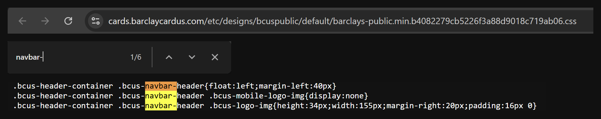
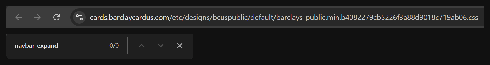

Before using Bootstrap, I built pages for my personal domain and a few clients that I've worked with closely, using HTML and CSS, and more recently Astro. I'd work with LLMs, like Claude, to write custom CSS for margins, navigation bars, flexbox layouts, and spacing, so my first impression of Bootstrap was how much of that work suddenly disappeared. In one exercise, a layout that previously needed several CSS rules could instead use classes such as `row` and `col` directly in the HTML. At first it almost felt like I was skipping part of the work. What helped was realizing that Bootstrap wasn't doing anything completely foreign. A Bootstrap row still relies on layout systems such as flexbox. The CSS didn't disappear. Someone else had already written it, and I was choosing to use their implementation.

## Knowing what's underneath

That became more useful as the exercises grew. Instead of rebuilding the same navigation and column structures every time, I could use Bootstrap's existing patterns and spend more time adjusting the page itself. I also ran into an example of why knowing CSS underneath the framework still matters. When I used a `fixed-top` navigation bar, it covered part of my page, because the fixed element was no longer taking up its normal space in the document. Bootstrap had made creating the navbar easier, but it didn't explain why the page behaved that way. Knowing what positioning and flexbox were doing underneath made the problem much easier to understand. I think this is where learning raw HTML and CSS first helped me. Classes like `row`, `col`, and `fixed-top` feel less like magic when I already have an idea of what they're replacing.

## Reading a framework from the outside

The part of this module I found most interesting wasn't building with Bootstrap. It was checking whether a site was already built with it. Before rebuilding a Barclays' About Us page, I had to confirm the site didn't use Bootstrap 5. I ran a short check in the browser console, searched the page source, and then opened the site's own stylesheet. Searching for `navbar-` found six matches, which looked like Bootstrap at first, but every match was the site's own class, `bcus-navbar-header`. Searching for Bootstrap's exact class, `navbar-expand`, found nothing. I could only tell the two apart because I'd learned what Bootstrap's classes look like. I think this is a skill I'll keep using when a website catches my attention, since I can now read how it was built.

*Searching the site's stylesheet. `navbar-` matches six times, but only in the site's own `bcus-navbar-header` class. Bootstrap's exact class, `navbar-expand`, doesn't appear at all.*

## Bootstrap or custom CSS

After this module, I don't think the choice is really Bootstrap versus custom CSS. I think they solve different parts of the same problem. A framework is useful for common structures that I'd otherwise keep rebuilding, while custom CSS is still useful when I want a page to look or behave in a specific way. I've already built websites without a UI framework, and after using Bootstrap I can see places where it could have saved time, especially with responsive layouts, navigation, and spacing. It does come with a cost, though. Every Bootstrap class in my HTML only works while Bootstrap is loaded, so the more of a page I hand to a framework, the more that page depends on something I don't control. At the same time, passing everything to a framework wouldn't remove the need to understand CSS. Bootstrap can give me a working structure quickly, but when something doesn't look right, I still need to understand what's happening underneath. For me, that's the main value of using a UI framework after learning the basics. It doesn't replace CSS. It gives me a faster way to use concepts I already understand.

*AI use: I used Claude to discuss and challenge my ideas for this essay and to produce a first draft, which I revised in my own words, and ChatGPT for grammar and wording feedback. The experiences described are my own.*