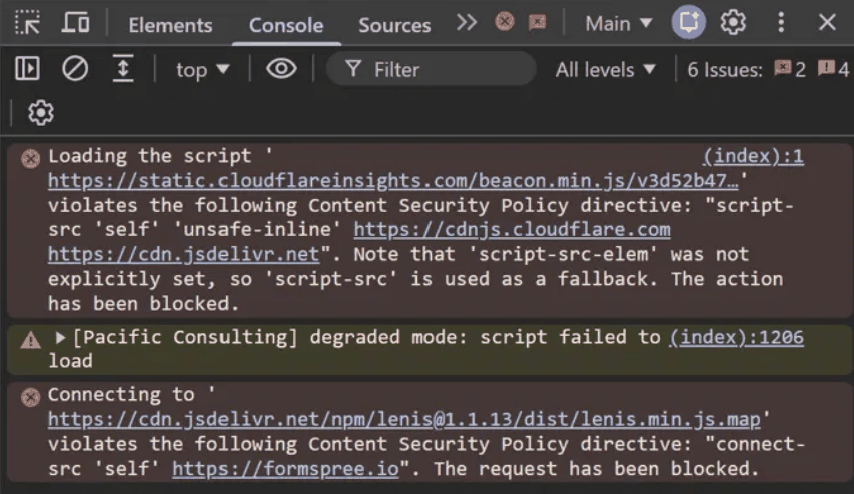

Over the past several months, I've built and launched a handful of websites, including one for a paying client. Large language models helped me turn ideas into working sites, but my ability to produce them was ahead of my understanding of the code. I could explain the design, intended behavior, and business requirements, but I couldn't always explain how the implementation worked. With a client depending on my work, that became a problem I needed to address.

I paid attention to obvious risks such as exposed API keys, credentials, and publishing sensitive information in public repositories. I also asked for security reviews and questioned suggestions that looked wrong. The limitation was that my reviews were still shaped by what I already knew to check. I could ask whether I had exposed a secret, but I was less prepared to evaluate how browser behavior, hosting features, and security settings interacted with one another. A site working correctly was not enough to prove that I understood why it worked.

That became clearer about a week after launching a client site, when I found that its services gallery had broken during one of my morning checks. Cards that were supposed to move horizontally were stacked vertically, and several images were missing, even though the site still looked normal on my machine and I had not deployed anything that morning. I initially suspected CSS, but while troubleshooting with Claude I checked the browser console and found a Content Security Policy error blocking a Cloudflare script. I had added the CSP several days earlier and configured it around the resources referenced in my own files without fully accounting for changes Cloudflare could make when serving the site. I changed the configuration, confirmed that the gallery worked again, and informed the client. The exact cause still needs qualification: the blocked script and the gallery failure appeared during the same investigation, but restoring the gallery did not establish a complete diagnosis of how the two were connected.

The incident exposed a limitation in how I was reviewing my work. I had been focused mainly on the files in my editor rather than the full system that existed once those files reached the browser through a hosting platform. That gap is part of why I'm pursuing a computer science degree. I want to better understand the systems behind what I build so I can evaluate generated code, investigate failures, and explain the decisions I make. I'll continue using LLMs because they have helped me work on projects beyond what I could have completed independently at this stage, but I also need to be able to verify what they produce and be clear about what I do and do not yet understand.

*AI use: I used ChatGPT for grammar, wording, and structural feedback while revising this essay. The experiences, technical details, and conclusions discussed are my own.*
